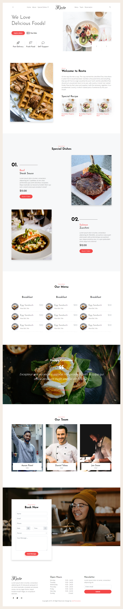

# Resto – Restaurant Landing Page

A static, single-page website for a fictional restaurant, **Resto**. It is built with plain **HTML5** and **CSS3**, with no build step, framework or backend. It is a front-end practice assignment focused on page layout, anchor navigation, a dropdown menu and responsive styling.



## Features

- Navigation bar with a centered logo, in-page links (Home, About, Special Dishes, Menu, Team, Reservation) and a search icon
- "Special Dishes" dropdown that jumps to individual dishes
- Hero section with the "We Love Delicious Foods!" headline, an "Explore Menu" button and slider arrow controls
- **About** section with a welcome message and a "Special Recipe" highlight
- **Special Dishes** section featuring Beef Steak Sauce and Salmon Zucchini with prices and "Book A Table" links
- **Our Menu** with three breakfast columns listing items and prices
- **Happy Customer** testimonial section
- **Team** section with chef cards
- **Reservation** form: name, email, phone, date, time, number of persons and a message
- Footer with social icons, open hours, newsletter signup and credits
- Hover effects on links, buttons and dish images
- Responsive styles using media queries for tablet (up to 768px) and mobile (up to 428px) widths

## Tech Stack

| Technology | Usage |
| --- | --- |
| HTML5 | Page structure |
| CSS3 | Layout, hover effects and media queries (`css/resto.css`) |
| Font Awesome 6.5.2 | Icons, loaded from the cdnjs CDN |

## Project Structure

```
Resto/
├── resto.html       # Main page
├── css/
│   └── resto.css    # All styles, including responsive rules
├── img/             # Logo, favicon, hero slides, dish photos, chef photos and section backgrounds
└── resto.png        # Screenshot / design preview
```

## Getting Started

### Prerequisites

A modern web browser. An internet connection is needed for the Font Awesome icons, which load from a CDN.

### Run locally

1. Clone the repository:
   ```bash
   git clone https://github.com/AmanPatil2002/Assignment.git
   ```
2. Go to the project folder:
   ```bash
   cd Assignment/Resto
   ```
3. Open `resto.html` in your browser, or use a static server, for example:
   ```bash
   npx serve .
   ```
   Then open `resto.html` from the served page.

## Customization

- **Colors, fonts and spacing:** edit `css/resto.css`.
- **Images:** replace the files in `img/`, keeping the same file names or updating the references in the HTML and CSS.
- **Dishes, menu items and prices:** edit the matching sections in `resto.html`.
- **Open hours, contact and social links:** edit the footer in `resto.html`.

## Known Limitations

- Several links, such as "Explore Menu", "Book A Table", the search icon and the social icons, are placeholders (`href=""`) and do not point anywhere yet.
- The hero slider arrows are static, so the hero does not actually change slides.
- The reservation form and newsletter signup have no backend or validation, so submitting them does nothing.
- The menu repeats the same sample item ("Egg Sandwich, $30") in every column.
- The Team section heading repeats the testimonial text ("Testimony / Happy Customer") and could be renamed, for example to "Our Chefs".
- The main file is named `resto.html` rather than `index.html`, so hosting services such as GitHub Pages will not open it by default. Rename it to `index.html` if you want to publish the page.
- A few labels contain typos (for example "Delicuous" and "Streak") that you may want to fix.

## Author

**Aman Patil** – [@AmanPatil2002](https://github.com/AmanPatil2002)

## License

This project is for learning and assignment purposes. Add a license of your choice if you plan to share or reuse it.
